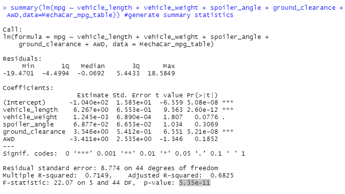

# MechaCar_Statistical_Analysis

## Linear Regression to Predict MPG

**Which variables/coefficients provided a non-random amount of variance to the mpg values in the dataset?**

- According to our results, vehicle_length  and ground_clearance (as well as intercept) are statistically unlikely to provide random amounts of variance to the linear model (the p-value for these variables is less than 0.05); These variables have a significant impact on mpg
- In our case the intercept is statistically significant, which means there are other variables and factors that contribute to the variation in mpg that have not been included in our model

**Is the slope of the linear model considered to be zero? Why or why not?**

- The p-value of our linear regression analysis is  5.35 x 10-11, which is much smaller than our assumed significance level of 0.05%. Therefore, we can state that there is sufficient evidence to reject our null hypothesis, which means that the slope of our linear model is not zero

**Does this linear model predict mpg of MechaCar prototypes effectively? Why or why not?**

- According to the summary output, the r-squared value is 0.7149 which shows that our model is predicting the mpg correctly in 7 out of 10 cases (70%)

- Although the multiple linear regression model is predicting well with our current dataset, the lack of significant variables is evidence of overfitting; Overfitting means that the performance of a model performs well with a current dataset, but fails to generalize and predict future data correctly; therefore, more variables that contribute to the variation in mpg should be collected to increase the accuracy of the model;

## Summary Statistics on Suspension Coils

**The design specifications for the MechaCar suspension coils dictate that the variance of the suspension coils must not exceed 100 pounds per square inch. Does the current manufacturing data meet this design specification for all manufacturing lots in total and each lot individually? Why or why not?**

- The current manufacturing data meet the design specification for all manufacturing lots in total (variance is 62 which is below the specified 100)

- When we look at each lot individually, Lot 1 and 2 meet this specifications but Lot 3 does not (variance is over 170 which is over the specified 100 )

## T-Tests on Suspension Coils

**Determine if the PSI across all manufacturing lots is statistically different from the population mean of 1,500 pounds per square inch**

- p-value is 0.06028; Therefore, we do not have sufficient evidence to reject the null hypothesis, and we can state that the two means are statistically similar

**Determine if the PSI across each individual manufacturing lot is statistically different from the population mean of 1,500 pounds per square inch**

- For Lot1 the p-value is 1; Therefore, we do not have sufficient evidence to reject the null hypothesis, and we can state that the two means are statistically similar

- For Lot2 the p-value is 0.6072; Therefore, we do not have sufficient evidence to reject the null hypothesis, and we can state that the two means are statistically similar

-For Lot3 the p-value is 0.04168 (less than 0.05); Therefore, we do have sufficient evidence to reject the null hypothesis, and we can state that the two means are statistically different

## Study Design: MechaCar vs Competition

**What metric or metrics are you going to test?**
- City or highway fuel efficiency
- Safety rating

**What is the null hypothesis or alternative hypothesis?**
- City or highway fuel efficiency
    - H0 : The means of all groups are equal, or µ1 = µ2 = … = µn.
    - Ha : At least one of the means is different from all other groups.

- Safety rating (test 2 groups at a time company vs. 1 competitor)
    - H0 : There is no difference in frequency distribution between both groups.
    - Ha : There is a difference in frequency distribution between both groups

**What statistical test would you use to test the hypothesis? And why?**
- ANOVA to test city or highway fuel efficiency (Is there a statistical difference between the distribution means from multiple samples?)
- Chi-Squared test to test safety rating (Is there a difference in categorical frequencies between groups?)

**What data is needed to run the statistical test?**
- Company name
- Vehicle Class
- City or highway fuel efficiency for each company and product
- Safety rating for each company and product 